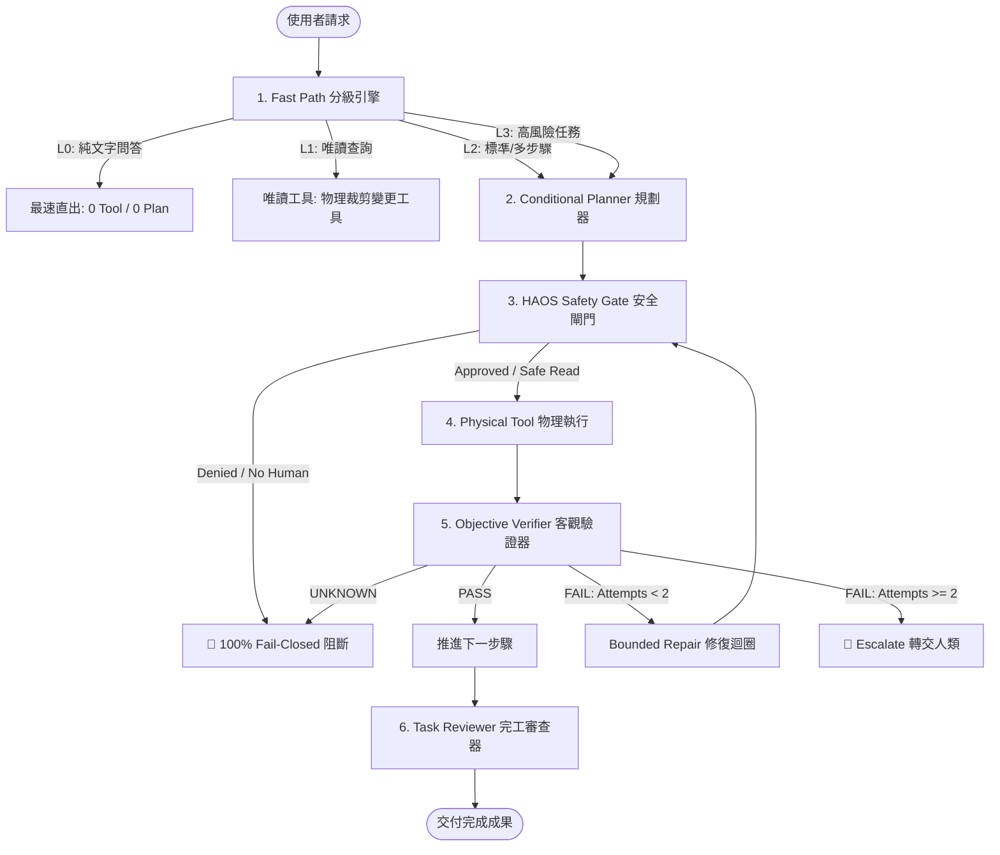

# 🚀 HERMES HYBRID CORE — 系統架構技術規格書 (Master Specification)

> **定位**：Local Autonomous Hybrid AI Agent Framework  
> **核心使命**：**簡單任務最速直出、複雜任務可靠規劃、高風險任務安全閉環、成功流程沉澱為技能。**

---

## 📑 目錄

1. [執行摘要與硬體環境 (Executive Summary & Hardware)](#1-執行摘要與硬體環境)
2. [頂尖 Agent 能力融合矩陣 (Agent Fusion Layer)](#2-頂尖-agent-能力融合矩陣)
3. [核心模組架構 (Core Pillars)](#3-核心模組架構)
4. [四級執行生命週期 (L0 ~ L3 Execution Tiers)](#4-四級執行生命週期)
5. [客觀驗證與修復合約 (Objective Verifier & Repair Contract)](#5-客觀驗證與修復合約)
6. [分層記憶與知識治理 (Memory vs Knowledge vs Skill vs Policy)](#6-分層記憶與知識治理)
7. [極速推論三引擎 (Triple Speed Engine)](#7-極速推論三引擎)

---

## 1. 執行摘要與硬體環境

### 1.1 核心升級理念
傳統聊天機器人與現代 Hybrid Agent 的根本差異：

```text
傳統聊天機器人                   HERMES HYBRID AGENT
┌────────────────┐             ┌────────────────────────────────────────────────────────┐
│  使用者輸入    │             │ 理解 ──► 分級 ──► 規劃 ──► 執行 ──► 安全閘 ──► 客觀驗證 │
│       │        │             │                                             │          │
│       ▼        │    ───►     │ 修復 (≤2次) ◄───────────────────────────────┘          │
│  LLM 直接回答  │             │   │                                                    │
│ (自稱成功/偏離)│             │   ▼                                                    │
└────────────────┘             │ 完工審查 ──► 成功經驗沉澱為 Skill ──► 交付使用者       │
                               └────────────────────────────────────────────────────────┘
```

### 1.2 本地自主策略
* **硬體平台**：本地多 GPU（32GB+ VRAM），支援並行推論與上下文高速加載。
* **本地主力模型**：本地部署 27B+ 等級量化模型，承擔所有日常對話、任務規劃、工具執行、客觀驗證與完工審查。
* **零雲端配額依賴**：完全杜絕網路延遲、連線中斷、API 429 速率限制與敏感資料外洩。

---

## 2. 頂尖 Agent 能力融合矩陣

| 借鑑機制 | 核心設計 | 帶來的具體價值 |
| :--- | :--- | :--- |
| **Fast Path** | 快速迭代 / 工具物理裁剪 | 簡單任務不拖慢，0-Tool 直出秒回 |
| **Conditional Planner** | 長程規劃 / 狀態機拆解 | 複雜重構任務先拆解再執行 |
| **Objective Verifier** | 沙盒隔離 / 客觀驗證 | 絕不採信模型自稱成功，物理檢驗 Exit Code/AST |
| **Bounded Repair Loop** | 有限修復 (Max 2 Attempts) | 杜絕無限修復死循環，超限強制請求人類介入 |
| **HAOS Safety Gate** | 權限邊界 / Fail-Closed | 高風險操作嚴格 Fail-Closed，無審批絕對阻斷 |

---

## 3. 核心模組架構



---

## 4. 四級執行生命週期 (L0 ~ L3 Execution Tiers)

| 層級 | 定義 | 工具策略 (Tool Schema) | 規劃與審查策略 | 適用場景範例 |
| :--- | :--- | :--- | :--- | :--- |
| **L0 — FAST** | 純文字與概念問答 | `tools = []` (物理裁剪) | 0 Planner, 0 Reviewer, 0 額外 LLM | 翻譯、演算法概念解釋、語法說明 |
| **L1 — READONLY** | 檔案與日誌唯讀查詢 | 僅保留 `READONLY_TOOL_NAMES` | 0 Planner, 0 Reviewer, 低延遲直出 | 檢視設定檔內容、查詢 log、grep 搜尋 |
| **L2 — STANDARD** | 標準檔案修改與腳本執行 | 完整工具集 (`tools = [...]`) | 單步直接執行；多步驟條件啟動 Planner | 建立 Python 模組、修正程式碼 Bug、單元測試 |
| **L3 — CRITICAL** | 系統變更與破壞性指令 | 完整工具集 (受限於審批) | 強制啟動 Planner + Safety Gate Approval | 系統破壞性指令、敏感核心設定變更 |

---

## 5. 客觀驗證與修復合約 (Objective Verifier & Repair)

* **Tri-State 判定**：`PASS`（客觀成功）、`FAIL`（客觀失敗）、`UNKNOWN`（未知/異常）。
* **核心紅線**：**`UNKNOWN ≠ PASS`**。若無法取得客觀 Exit Code 或檔案狀態，一律 Fail-Closed 阻斷，禁止假設成功。
* **Bounded Repair Loop**：同一目標修復上限為 2 次，第 3 次失敗強制轉交人類，徹底消滅無窮死循環。

---

## 6. 極速推論三引擎 (Triple Speed Engine)

* **語義快取層 (`semantic_cache.py`)**：高頻日常問答 **<5ms** 秒級直出，免燒 GPU 算力。
* **骨架秒回層 (`skeleton_streamer.py`)**：**<50ms** 即時噴出結構化框架，消滅等待空白。
* **投機執行層 (`speculative_executor.py`)**：**微秒級** 數據平行預跑，大幅降低 I/O 等待。
