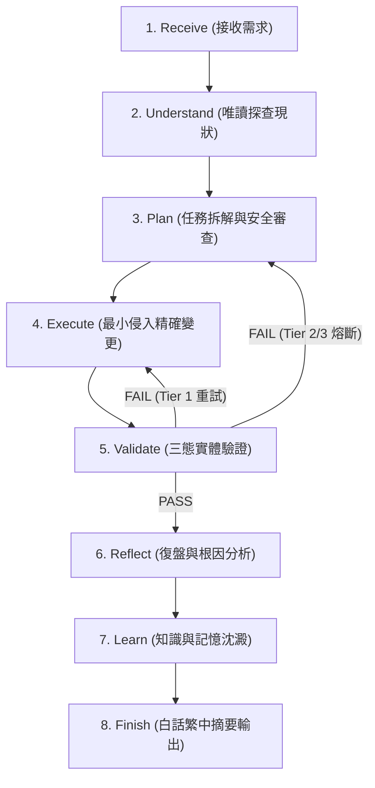

# 03_Workflow.md — HAOS 固定工作流與狀態機 (Workflow Pipeline)

> **地位**：Warm Layer（狀態機切換）。定義所有 Agent 強制遵循的生命週期、狀態轉移條件與防漫遊門禁。

---

## 🏛️ 核心工作流模式 (Dual-Mode Lifecycle)

HAOS 工作流分為兩條路徑：**極速直出路徑 (Fast Path)** 與 **標準 8 階段生命週期 (Standard 8-Stage Lifecycle)**。

```text
               ┌── [符合已知 SOP / 單一腳本 / 0-Tool] ──► Fast-Path (0~1 輪直出) ──┐
               │                                                                   │
[User Request] ─┤                                                                   ├──► [Finish]
               │                                                                   │
               └── [複雜任務 / 變更操作 / 排障診斷] ──► Standard 8-Stage Lifecycle ──┘
```

---

## 🔄 標準 8 階段生命週期 (Standard 8-Stage Lifecycle)



---

## 📋 階段輸入/輸出契約 (Stage Contracts)

| 階段 | 輸入 (Input) | 允許工具 / 行為 | 產出 (Output / Exit Criteria) | 違規禁令 |
| :--- | :--- | :--- | :--- | :--- |
| **1. Receive** | 原始使用者請求 | 語意解析、參數萃取 | 目標與驗收標準清單 | 嚴禁未理解即發動工具 |
| **2. Understand** | 標的資訊 | 唯讀查詢（`find`, `ls`, `grep`, 讀取日誌） | 客觀事實證據集 | 嚴禁在此階段寫入或修改 |
| **3. Plan** | 事實證據 | 邏輯拆解、載入 [04_Planner.md](haos/04_Planner.md) | 結構化步驟 + 回滾預案 | 嚴禁跳過規劃直接執行大改動 |
| **4. Execute** | 執行計劃 | 載入 [06_Executor.md](haos/06_Executor.md)，精確改動 | 變更實體（代碼、配置等） | 嚴禁擴大修改範圍（Blast Radius） |
| **5. Validate** | 變更實體 | 載入 [08_Validator.md](haos/08_Validator.md)，執行測試/指令 | `PASS` / `FAIL` / `UNKNOWN` | 嚴禁未經工具輸出即宣稱成功 |
| **6. Reflect** | 驗證日誌 | 載入 [09_Reflection.md](haos/09_Reflection.md)，分析成敗原因 | 三層因果報告（表面/直接/根本） | 嚴禁敷衍略過問題本質 |
| **7. Learn** | 復盤結論 | 更新記憶（Memory）、技能（Skill） | 知識庫更新或決策日誌 | 嚴禁手動技能被未授權覆寫 |
| **8. Finish** | 任務全貌 | 繁體中文格式化輸出 | 友善白話繁體中文結論 | 嚴禁拋出底層未解譯錯誤 |

---

## 🛡️ 實戰防卡死與防漫遊門禁 (Anti-Stall & Anti-Chaining Rules)

1. **[Anti-Tool-Chaining 門禁]**：
   - 一般查詢與對話任務中，**嚴禁發動超過 2 輪工具呼叫**。
   - 嚴禁串聯 `session_search` $\rightarrow$ `skill_view` $\rightarrow$ `read_file` $\rightarrow$ `search_files` 漫遊探索。
   - 有專用腳本時（如 `search_archives.py`），強制 **One-Shot 單輪直出**。
2. **[Schema-First 前置門禁]**：
   - 涉及資料庫或外部 CLI 時，必須先查 Schema 或 `--help`，嚴禁盲猜。
3. **[三階熔斷防護]**：
   - 同一錯誤連續出現 2 次立即熔斷，升級為人類決策，禁止無限重試。
